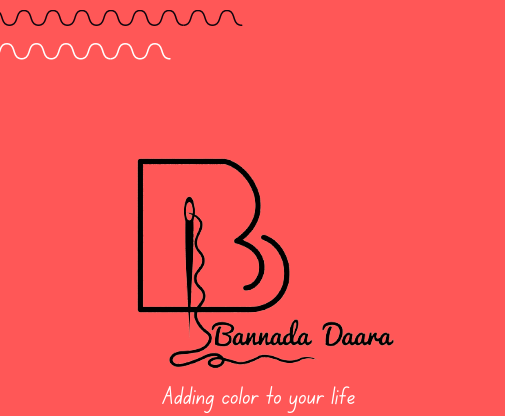

# Bannada Daara 🌈

A modern, responsive website for Bannada Daara - an eco-friendly, handmade products initiative specializing in upcycled textile products.



## 🌟 Features

- ✅ **Responsive Design**: Mobile-first approach with smooth animations
- ✅ **Modern UI**: Clean, professional design with gradient accents
- ✅ **Product Catalog**: Complete listing of bags, pouches, stationery, and decor items
- ✅ **WhatsApp Integration**: Direct ordering through WhatsApp
- ✅ **Performance Optimized**: Fast loading with Vite
- ✅ **SEO Friendly**: Proper meta tags and semantic HTML
- ✅ **Accessibility**: ARIA labels and semantic markup
- ✅ **Security**: Proper rel attributes for external links

## 🚀 Quick Start

### Prerequisites

- Node.js (v16 or higher)
- npm or yarn
- Git

### Installation

```bash
# Clone the repository
git clone https://github.com/Bannadadara/Bannadadara.git

# Navigate to project directory
cd Bannadadara

# Install dependencies
npm install

# Start development server
npm run dev
```

The site will be available at `http://localhost:5173`

## 📦 Build for Production

```bash
# Create production build
npm run build

# Preview production build locally
npm run preview
```

## 🌐 Deployment Options

### Option 1: Deploy to GitHub Pages (Recommended)

1. **Update vite.config.js** - Make sure the `base` matches your repository name:
   ```js
   base: '/Bannadadara/' // Your repo name
   ```

2. **Enable GitHub Pages**:
   - Go to your repository on GitHub
   - Settings → Pages
   - Source: Deploy from a branch
   - Branch: Select `gh-pages` and `/(root)`
   - Save

3. **Deploy**:
   ```bash
   npm run deploy
   ```

4. **Access your site**: `https://yourusername.github.io/Bannadadara/`

### Option 2: Deploy to Netlify

1. Push your code to GitHub
2. Go to [Netlify](https://www.netlify.com/)
3. Click "New site from Git"
4. Choose your repository
5. Build settings:
   - Build command: `npm run build`
   - Publish directory: `dist`
6. Click "Deploy site"

**For custom domain on Netlify**:
- Update `vite.config.js`: Change `base: '/Bannadadara/'` to `base: '/'`
- Redeploy

### Option 3: Deploy to Vercel

1. Push your code to GitHub
2. Go to [Vercel](https://vercel.com/)
3. Click "Import Project"
4. Select your repository
5. Vercel will auto-detect Vite configuration
6. Click "Deploy"

**For custom domain on Vercel**:
- Update `vite.config.js`: Change `base: '/Bannadadara/'` to `base: '/'`
- Redeploy

### Option 4: Deploy to Custom Server

```bash
# Build the project
npm run build

# Upload the 'dist' folder to your server
# Configure your web server to serve the files
```

## 🛠️ Technologies Used

- **React 18**: Modern React with hooks
- **Vite**: Next-generation frontend tooling
- **CSS3**: Custom styles with CSS variables
- **JavaScript ES6+**: Modern JavaScript features

## 📁 Project Structure

```
bannada-daara/
├── public/
│   └── logo.png              # Brand logo
├── src/
│   ├── components/           # Reusable components
│   │   ├── Header.jsx
│   │   └── Footer.jsx
│   ├── sections/            # Page sections
│   │   ├── Hero.jsx
│   │   ├── About.jsx
│   │   ├── Services.jsx
│   │   ├── Products.jsx
│   │   ├── Note.jsx
│   │   └── Contact.jsx
│   ├── data/
│   │   └── products.js      # Product catalog
│   ├── styles/
│   │   └── index.css        # Global styles
│   ├── App.jsx              # Main app component
│   └── main.jsx             # Entry point
├── index.html
├── vite.config.js
├── package.json
├── .gitignore
└── README.md
```

## 🎨 Customization Guide

### Update Colors

Edit CSS variables in `src/styles/index.css`:

```css
:root {
  --primary-color: #4a90e2;    /* Main brand color */
  --secondary-color: #50c878;   /* Secondary brand color */
  --accent-color: #ff6b6b;      /* Accent color */
  /* ... more colors */
}
```

### Update WhatsApp Number

Replace `918105750221` in:
- `src/components/Header.jsx` (line 10)
- `src/sections/Products.jsx` (line 22)

### Update Contact Information

Edit `src/sections/Contact.jsx`:
- Phone number
- Instagram handle
- Email address

### Add/Remove Products

Edit `src/data/products.js`:

```js
{
  id: 26,                           // Unique ID
  name: "New Product Name",         // Product name
  category: "Category",             // Product category
  price: 500                        // Price (number or "On request")
}
```

### Update Logo

Replace `public/logo.png` with your logo (recommended: 200x200px, PNG format)

## 🐛 Issues Fixed

This repository fixes the following issues from the original code:

1. ✅ **Security**: Added `rel="noopener noreferrer"` to all external links
2. ✅ **Accessibility**: Added ARIA labels and semantic HTML
3. ✅ **Styling**: Replaced inline styles with organized CSS
4. ✅ **Responsive Design**: Added mobile-first responsive design
5. ✅ **Footer**: Dynamic year display
6. ✅ **SEO**: Added meta tags and descriptions
7. ✅ **Code Organization**: Better file structure and naming
8. ✅ **Performance**: Optimized CSS and animations
9. ✅ **Documentation**: Comprehensive README and comments

## 📞 Contact

- **Phone**: [81057 50221](tel:+918105750221)
- **Instagram**: [@bannada_daara_21](https://instagram.com/bannada_daara_21)
- **Email**: [lavanyajyothigudde@gmail.com](mailto:lavanyajyothigudde@gmail.com)

## 📝 License

© 2024 Bannada Daara. All rights reserved.

## 🤝 Contributing

Contributions, issues, and feature requests are welcome!

1. Fork the repository
2. Create your feature branch (`git checkout -b feature/AmazingFeature`)
3. Commit your changes (`git commit -m 'Add some AmazingFeature'`)
4. Push to the branch (`git push origin feature/AmazingFeature`)
5. Open a Pull Request

## 💚 About Bannada Daara

Bannada Daara is a home-grown initiative started in 2020, creating hand-stitched products using upcycled textile excesses. We believe in:

- ♻️ **Sustainability**: Reducing textile waste
- ✋ **Handmade craftsmanship**: Each piece is unique
- 🎨 **Custom designs**: Personalized creations
- 🌱 **Eco-friendly practices**: Better for the planet

---

Made with 💚 by Bannada Daara | Powered by React & Vite
